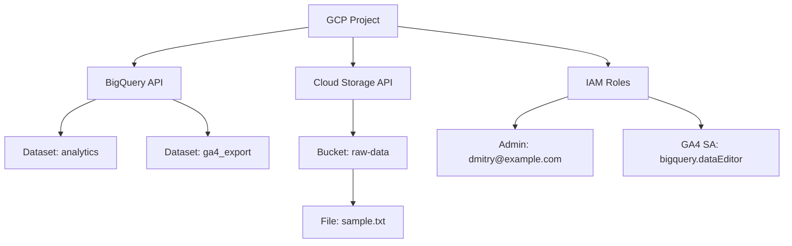

# 🚀 Data Engineering Infrastructure on GCP with Terraform

## 📘 About the Project
This project is a template for **Data Engineering infrastructure on Google Cloud Platform (GCP)** managed through **Terraform**.  
It demonstrates best practices: automating project creation, enabling APIs, configuring IAM, creating storage and analytical datasets.  

---

## 📂 Project Structure

```
terraform/
├── main.tf            # Core resources (API, bucket, dataset, IAM)
├── variables.tf       # Variable definitions
├── terraform.tfvars   # Variable values (project_id, region)
├── outputs.tf         # Outputs after apply
└── modules/           # Reusable modules (optional)
```

---

## 🔑 Resources Created

1. **GCP Project**  
   - New project in the organization, linked to billing.  
   - Administrator assigned (`roles/owner`).  

2. **APIs**  
   - BigQuery API (`bigquery.googleapis.com`)  
   - Cloud Storage API (`storage.googleapis.com`)  

3. **BigQuery**  
   - Dataset `analytics` for analytics.  
   - Dataset `ga4_export` for Google Analytics 4 export.  
   - IAM role `roles/bigquery.dataEditor` for GA4 service account.  

4. **Cloud Storage**  
   - Bucket `${project_id}-raw-data` for raw data storage.  
   - Uploaded test file `sample.txt`.  

---

## 📊 Project Diagram



---

## ⚙️ Setup and Usage

1. Install Terraform ≥ 1.8.0.  
2. Create a Terraform service account in GCP with roles:  
   - `roles/resourcemanager.projectCreator`  
   - `roles/billing.user`  
   - `roles/storage.admin`  
   - `roles/bigquery.admin`  
3. Download the JSON key and set the path:  
   ```powershell
   $env:GOOGLE_APPLICATION_CREDENTIALS="C:\Users\D\Desktop\GCP\secrets\terraform-sa.json"
   ```
4. Run Terraform:  
   ```powershell
   cd terraform
   terraform init
   terraform plan
   terraform apply -auto-approve
   ```

---

## 📌 Best Practices

- **.gitignore**  
  ```
  .terraform/
  terraform.tfstate
  terraform.tfstate.backup
  *.json
  ```
- **Backend**: store Terraform state in a GCS bucket.  
- **CI/CD**: configure GitHub Actions for automatic deployment.  
- **Documentation**: use comments in `.tf` files and diagrams in README.  

---

## 🎯 Result
After applying the configuration you will have:  
- A new project in GCP.  
- Enabled BigQuery and Cloud Storage APIs.  
- Datasets for analytics and GA4.  
- Bucket for file storage.  
- Configured IAM roles for admin and GA4 service account.  
